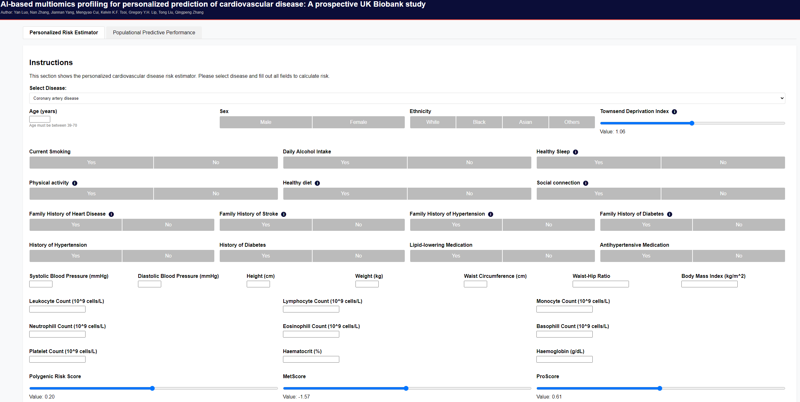

# Multi-omics Cardiovascular Disease

This repository contains the UI and backend code for the paper "Multi-omics Cardiovascular Disease".

run this docker-compose command to start the service:
```
docker-compose up --build
```

see our demo website here:
[demo site](https://working-sheilah-hkuqpteam-78ebb534.koyeb.app/)




Citation

```python
@article{ai-myltiomics25,
title={AI-based multiomics profiling for personalized prediction of cardiovascular disease: A prospective UK Biobank study},
author={Yan Luo, Nan Zhang, Jiannan Yang, Mengyao Cui, Kelvin K.F. Tsoi, Gregory Y.H. Lip, Tong Liu, Qingpeng Zhang},
year={2025},
}
```